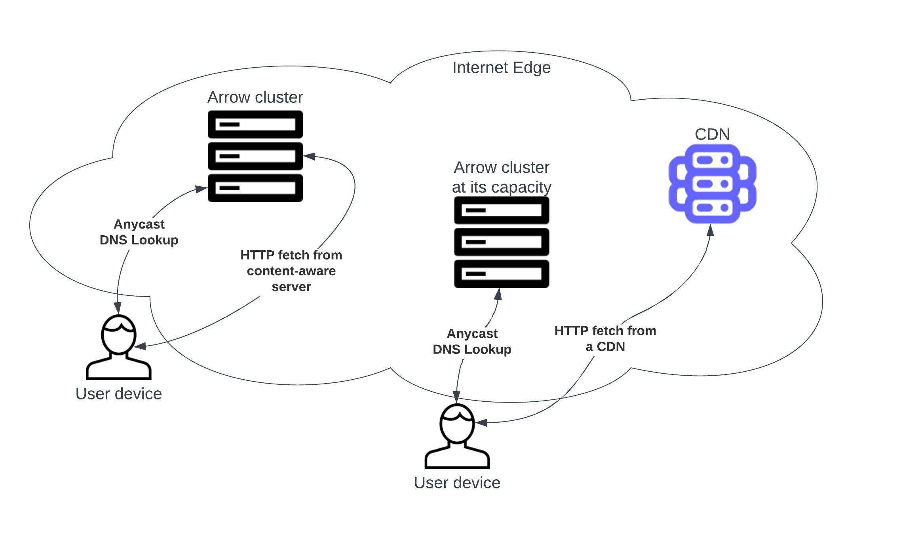

## Arrow monitor and efficient media-delivery system
Measures **bitrate per user** (_brpu_) a server, a member of a cluster, is capable to sustain real time. It allows load-balancing with a minimal _brpu_ guarantee that can be aligned with bitrates media content is encoded at. This guarantee as a service level objective ensures uninterrupted media consumption (quality of user experience) and builds a solid basis for horizontal and vertical capacity planning (optimal distribution of infrastructure costs).

_Arrow_ is intended to sit on top of CDN(s) and let them serve overflow traffic only. While handling all the traffic is a possibility too, without CDN being an overflow hedge **bitrate per user** guarantee can be violated.

### Fractal Design
This is an anti-master design pattern, wherein each node of a cluster holds complete state of the cluster and, thus, runs autonomously. Failure of any node could only impact existing connections (users) but not newcomers. Same applies to SSD storage units within a single node.
### Bottleneck Dance
Any content delivering server is typically constrained by 1/ CPU cycles; 2/ network bandwidth; 3/ block I/O bandwidth (between RAM and a longer-term storage such as SSD). Arrow accounts for all of them. Furthermore, hardware and network architecture/revision should aim to keep the three in balance. Significant imbalance will negatively influence the total cost of ownership.
### Bandwidth v Storage Trade-off
Every node (a CDN machine) adds either $S_i$ of caching storage or $B_i$ of streaming bandwidth to a cluster at a point of presence (PoP). Arrow balances user requests to maximize the storage as long as the _brpu_ guarantee is observed. The storage will be automatically sacrificed but only at times when the bandwidth needs expansion.
### Configurations by example
There are variants in configuration of the CDN affecting performance. They rely on consistent hashing of keys pertinent to a content structure. By example, assuming a movie called "matrix":
- Request URL: `https://cdn.foo.com/assets/matrix/manifest.mpd?a=b&c`
- Cache key: `foo.com/assets/matrix/manifest.mpd`
- Cluster key: `foo.com<md5(/assets/matrix)>`

Note, `matrix/` folder is likely to also have the movie's chunks we want on one same node with the manifest file, the `/assets/matrix` part is a customer-specific regex, and the first technical label(s) of the hostname (e.g., cdn.) are omitted.
#### Classic CNAME to engage CDN
This is a well-known approach. User requests land on cluster nodes at random. When a node is not designated to cache the content, it pulls from the designated one. As such, at worst double bandwidth is taken from the cluster compared with the best case of local caching. With $n$ being a number of nodes in a cluster and $i$ - a number of nodes mirroring the same content:

$brpu(i) \propto (2 - i/n)^{-1}$  
$storage(i) \propto (1 + n - i)$

Arrow manages $i$ automatically, and with large $n$ _brpu_ is at half of its potential, so it can be doubled at the expense of storage (origin offload). Lowering $n$ down to 2 would render a bit over 30% loss on traffic forwarding. Although it seems not very elegant, few solutions on the market could offer automatic bandwidth/storage trade-off. No one goes as far as _brpu_ guarantee.
#### Content-Aware engagement
If you are flexible about hostname part of the URL initiating playback (such as a manifest file URL), you could construct the following request:
- `https://md5</assets/matrix>.cx.foo.com/assets/matrix/manifest.mpd?a=b&c`

Instead of classic CNAME for `cdn` label, `foo.com` zone would have:
```
cx       NS  cx-glue.foo.com.
cx-glue  A   <AnycastIP1> (a cluster node)
cx-glue  A   <AnycastIP2> (a cluster node)
```
`cx` is an arbitrary delegation (could be `cdn` as well). Now the cluster can respond with a unicast address of a node having the content based on the cluster key, here, available at the DNS look-up. With this content-awareness at DNS level:

$brpu \propto n$  
$storage \propto n$

Neither traffic forwarding nor content mirroring is required.

**NB** Both configurations described above can run concurrently as keys stay all the same.
### Implementation
Arrow cluster consists of commercial off-the-shelf (COTS) hardware.

`arrow` package implements a service exposing a shared memory region with _brpu_ and _weight_ (used to quantify storage as nodes can be individually sized). The region contains a record for every node in the cluster. The records get updated by multicast _comets_. A stale record would signal out-of-service node that could be automatically excluded from the game.

Each node is on record by its canonical name obtained by a reverse look-up by an IP address. Therefore, either PTR record or `/etc/hosts` file must reflect zone's information for the whole cluster. For example, a two-nodes cluster may be known as:
```
n01.lax.hw.bar.net.    600  IN  A     178.62.11.17
n01.lax.hw.bar.net.    600  IN  AAAA  2a03:e0c0:d0::14:f001

n02.lax.hw.bar.net.    600  IN  A     178.62.11.18
n02.lax.hw.bar.net.    600  IN  AAAA  2a03:e0c0:d0::14:f002
```

Each _hosts_ file could then contain:
```
178.62.11.17           n01.lax.hw.bar.net
178.62.11.18           n02.lax.hw.bar.net

2a03:e0c0:d0::14:f001  n01.lax.hw.bar.net
2a03:e0c0:d0::14:f002  n02.lax.hw.bar.net
```

Although it may seem redundant at a first glance, this level of indirection simplifies node-level DNS exchange - only CNAMEs are returned - and, more importantly, allows grouping nodes analogues to Akamai's serials.

In reality, we use a prefix to anycast a service, for example a CIDR /24 containing 255 IPv4 addresses. Four out of those 255 could constitute DNS glue (see above), and other 80 (for instance) could be distributed across nodes in a cluster to handle HTTP(S) requests: a cluster of 4 nodes => each node gets 20 addresses it serves, a cluster of 20 nodes => each node gets 4 addresses it is known by. This architecture would be more DoS-resilient than unicast-addressing; on the other hand, it still allows arbitrary number of nodes in a cluster.

`lib` package implements a shared library function that takes a cluster key and returns a corresponding in-service node along with indications of an error, overload, or self-serving. The library is used by a Lua module (part of the package) that integrates with [Openresty package](https://openresty.org/) to do HTTP(S) part of the game.

`pdns` is an integration with [PowerDNS](https://doc.powerdns.com/authoritative/backends/lua2.html) via above `lib` package.
### PoC
Consider
```
# curl -skD- "https://c.dx.claw.ac/assets3/matrix/manifest.mpd?a=b&c"
HTTP/1.1 200 OK
Connection: keep-alive
Server: n01.lax.hw.hyvd.net
Access-Control-Allow-Origin: *

Act >0<
Hash input_: /assets3/matrix
Cluster key: claw.acaa22fad1ed4a441d54fa664f53d5b0ee
Cache__ key: claw.ac/assets3/matrix/manifest.mpd
Pull_: http://n02.lax.hw.hyvd.net/assets3/matrix/manifest.mpd?a=b&c
```
This cluster nodes determine the asset should be cached at `n02`. Hostname of the request above is not content-aware, so its resolution flaps with a short-lived CNAME:
```
# dig c.dx.claw.ac

;; ANSWER SECTION:
c.dx.claw.ac.           5       IN      CNAME   n02.lax.hw.hyvd.net.
n02.lax.hw.hyvd.net.    3600    IN      A       3.3.3.2
```
or
```
# dig c.dx.claw.ac

;; ANSWER SECTION:
c.dx.claw.ac.           5       IN      CNAME   n01.lax.hw.hyvd.net.
n01.lax.hw.hyvd.net.    3600    IN      A       3.3.3.1
```
The result of the `curl` would stay the same regardless. With a content-aware hostname DNS resolution to `n02` stays consistent:
```
dig aa22fad1ed4a441d54fa664f53d5b0ee.dx.claw.ac

;; ANSWER SECTION:
aa22fad1ed4a441d54fa664f53d5b0ee.dx.claw.ac. 300 IN CNAME n02.lax.hw.hyvd.net.
n02.lax.hw.hyvd.net.    3600    IN      A       3.3.3.2

```
And `n01` node wouldn't get involved whatsoever:
```
# curl -skD- "https://aa22fad1ed4a441d54fa664f53d5b0ee.dx.claw.ac/assets3/matrix/manifest.mpd?a=b&c"
HTTP/1.1 200 OK
Connection: keep-alive
Server: n02.lax.hw.hyvd.net
Access-Control-Allow-Origin: *

Act >1< (self-serving)
Hash input_: /assets3/matrix
Cluster key: claw.acaa22fad1ed4a441d54fa664f53d5b0ee
Cache__ key: claw.ac/assets3/matrix/manifest.mpd
Pull_: http://n02.lax.hw.hyvd.net/assets3/matrix/manifest.mpd?a=b&c
```

